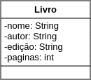
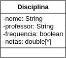
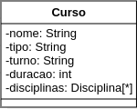
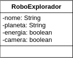
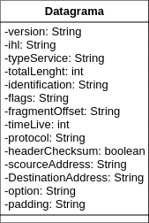

# *Lista 03*: Modelagem de Classes

## Livro

> Um livro possuiu seu nome, autor e edição (*String*) para se diferenciar um dos outros como atributos, juntamente da quantidade de páginas para identificar (*int*) atual localizão na leitura.

## Disciplina

> Uma disciplina possui um nome e professor (*String*) para se diferenciar uma das outras como atributos, juntamente da verificação frequencia de um aluno (*boolean*) e uma serie de notas (*double[ ]*) que formam um conceito final do aluno.

## Curso

> Um Curso possui um nome, tipo de gradução, turno (*String*) e duração (*int*)para se diferenciar um dos outros como atributos, juntamente de uma serie de Disciplinas (classe *Disciplina[ ]*) que formam o curso.

## Robô explorador de planetas

> Um Robô explorador de planetas precisa de um nome, o planeta que foi enviado para explorar (*String*) para que seja diferenciado um dos outros como atributos, juntamente com uma verifacação da sua energia e camera (*boolean*) para ver se estão funcionando corretamente.

## Datagrama IPv4

> Um datagrama consiste de um cabeçalho e os campos de dados que transportam o IP. O campo possui versão do protocolo; IHL ,Internet Header Length; o tipo do serviço; protocolos e endereços escritos em bytes, e o tamanho total do campo (*int*).